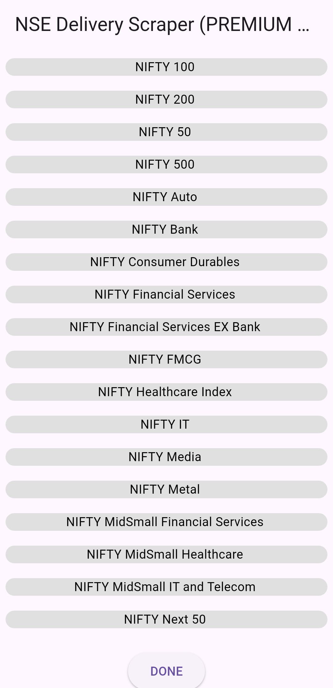
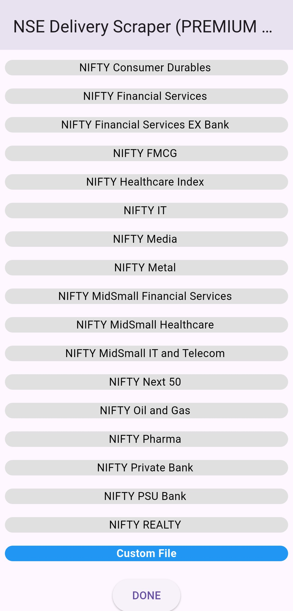
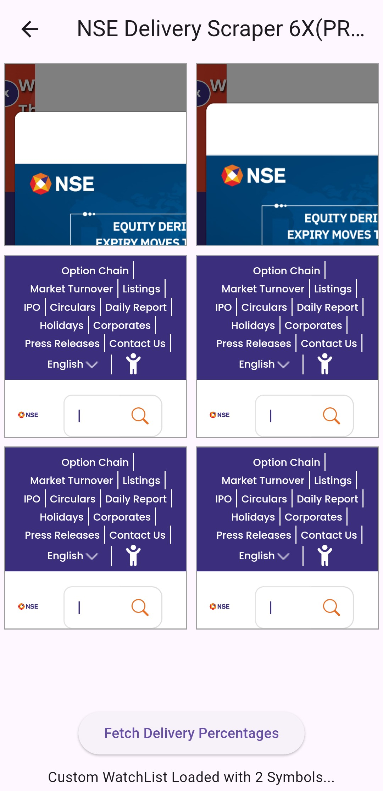

# NSE Delivery Scraper

This app scrapes the delivery percentages of stocks in bulk from the NSE (National Stock Exchange).

## Features

*   **Bulk Scraping:** Scrape delivery percentages for multiple stocks at once.
*   **Premium:** A premium version is available that allows scraping up to 6 stocks at a time.
*   **Custom File Upload:** You can provide a custom list of stocks to scrape.

## How to Use the Custom File Feature

1.  Create a `.txt` file.
2.  Add one stock symbol per line.
3.  Make sure to use plain stock symbols only (e.g., "RELIANCE"). Do not include suffixes like "-eq" or prefixes like "nse:".
4.  Upload the `.txt` file in the app.

## Known Issues

*   When opening the exported sheet in Google Sheets, you might see a "file corrupted" error. Please try opening the file with a different spreadsheet application, or the best solution is to open the file from the file manager.

## Bug Reports

If you find any bugs or have any issues, please email me at [rishibanota837@gmail.com](mailto:rishibanota837@gmail.com).

## Any Complaints, mail me I will remove the app within 5-7 Business Days.

## Screenshots

